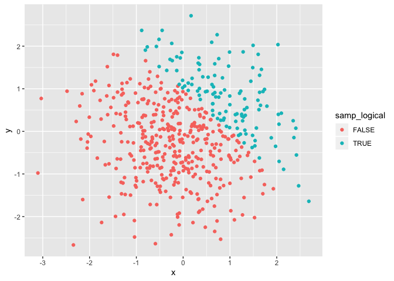
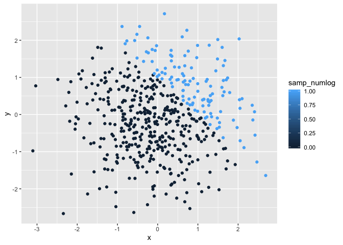
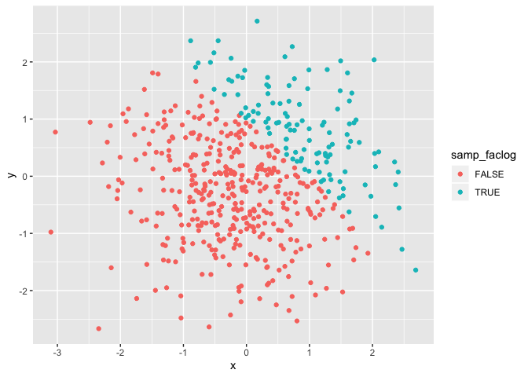

Prob HW1
================
Yingxi Ji
9/14/2019

# Problem 1

## Part a

``` r
## Creat a dataframe
ds = tibble(
  norm_samp = rnorm(8),
  norm_samp_pos = norm_samp > 0,
  norm_char = as.character("a","a","a","a","a","a","a","a"),
  samp_level = factor(c("low", "high", "medium", "high", "low", "medium", "high","low"), levels = c("low", "medium", "high")),
)
## Check levels
levels(pull(ds,samp_level ))
```

    ## [1] "low"    "medium" "high"

``` r
## Take the mean of each variable in the dataframe ds
mean_samp = mean(pull(ds, norm_samp))
mean_samp2 = mean(pull(ds, norm_samp_pos))

## Comment out vectors that can not be calculated

# mean_samp3 = mean(pull(ds, norm_char)), not logical, returning NA
# mean_samp4 = mean(pull(ds, samp_level)), not logical, returning NA
```

``` r
##Apply `as.numeric()` function on vectors
as.numeric(pull(ds, norm_samp_pos))
as.numeric(pull(ds, norm_char))
as.numeric(pull(ds, samp_level))
```

NA means that it doesn’t have a numeric meaning so it is not logical to
use `as.numeric()`

## Part b

``` r
samp_num = as.numeric(pull(ds,norm_samp_pos)) * pull(ds,norm_samp)
# samp_fac = as.factor(pull(ds,norm_samp_pos)) * pull(ds,norm_samp)
samp_final = as.numeric(as.factor(pull(ds,norm_samp_pos)))*pull(ds,norm_samp) 

## Call the values
samp_num
```

    ## [1] 0.0000000 0.3232713 0.0000000 0.0000000 0.4616485 1.6643217 1.6358419
    ## [8] 0.0000000

``` r
samp_final
```

    ## [1] -0.08955475  0.64654259 -0.55603246 -0.90848267  0.92329693  3.32864332
    ## [7]  3.27168381 -1.02716838

When I have numeric values, they are treated as numbers so that I can do
multiplication. For logic vector,it has values of either 0 or 1(meaning
True and False). However, for character vector and factor vector, they
are not math values so I can not take the mean and do multiplication.
The last line is to convert the logical vector to factor vector then
convert to numerical vector so I can still take the mean. Factor have
different values after applying `as.numeric` function because the values
of factor vector can be considered as levels.

## Problem 2

``` r
set.seed(150)
## Create a dataframe
ds2 = tibble(
  x = rnorm(500),
  y = rnorm(500),
  samp_logical = x + y > 1,
  samp_numlog = as.numeric(samp_logical),
  samp_faclog = as.factor(samp_logical)
)
```

The size of the data set is (500, 5) which means there are 500 rows and
5 columns.

The mean is -0.0032038.

The median is -0.0623617

The standard deviation is 0.9892022

The proportion is 0.238

``` r
## Creat ggplots of Y~X, colored by different third variables
## logical
ggplot(ds2, aes(x = x, y = y, color = samp_logical))+geom_point() 
```

<!-- -->

``` r
ggsave("polt_colored_by_logical_vector.pdf")
```

    ## Saving 7 x 5 in image

``` r
## numerical
ggplot(ds2, aes(x = x, y = y, color = samp_numlog))+geom_point() 
```

<!-- -->

``` r
#ggsave("polt_colored_by_numeric_vector.pdf")

## factor
ggplot(ds2, aes(x = x, y = y, color =  samp_faclog))+geom_point() 
```

<!-- -->

``` r
#ggsave("polt_colored_by_factor_vector.pdf")
```

The plot 1 is colored by logical vector. The red points are points with
x + y \< 1 and the blue points are poits with x + y \> 1. There is an
abovious sperate line between green and red data points. The line
approximately follows y = - x. Points are symmetrically based on the
line.

The plot 2 is colored by numeric vector. The colors are the intensity
given by the numbers. There is an abovious sperate line between lighter
and darker blue data points. The line approximately follows y = - x.
Points are symmetrically based on the line

The plot 3 is colored by factor vector. The red points are points with x
+ y \< 1 and the blue points are poits with x + y \> 1. There is an
abovious sperate line between green and red data points. The line
approximately follows y = - x. Points are symmetrically based on the
line
